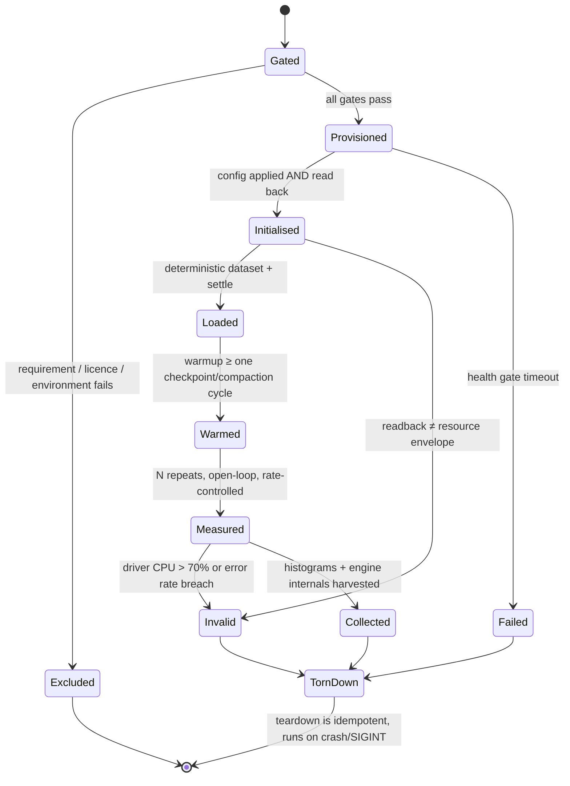

# Automated Datastore Selection via Workload Simulation — POC Plan

**Research completed:** 2026-09-01
**Status:** Complete
**Verification basis:** all mechanical claims were executed on an Apple M5 / macOS 26.6.2
/ Docker Desktop 4.88.1 (Engine 29.7.2, kernel 7.0.12-linuxkit, cgroup v2) on
2026-09-01. Raw logs are in `phase-3/*.log`; the scripts that produced them are in
`phase-3/*.sh` and `phase-3/*.py`. Version and licence claims were verified against
project releases, registries and official docs on the same date; anything that could
not be pinned to a primary source is marked **UNVERIFIED**.

---

## 1. Executive summary

**The ask:** simulate workloads for a greenfield prototype so that datastore choice can
be automated from a business use case, covering tooling, runtimes, containerisation,
automatic initialisation, and auditable reporting.

**The finding:** the measurement tools needed already exist and are mature. What does
not exist — verified by search, not assumed — is anything that turns a *business case*
into an *auditable recommendation*. The gap is the wrapper around measurement, and that
wrapper is what the POC should build.

**The recommended approach** is a decision harness, not a benchmark suite, structured
as `GATE → MEASURE → WEIGH`:

- **Gate first.** Hard requirements (transactional scope, durability, query
  capabilities, licence policy, environment feasibility) are evaluated as a pure
  function *before any container starts*. A candidate that cannot meet a hard
  requirement is excluded and never benchmarked. A fast wrong answer is more dangerous
  than no answer, and every existing tool will happily produce one.
- **Measure with enforced parity.** Phase 3 showed fair comparison is not a matter of
  passing the same flags. Three CPU-detection APIs disagree inside a single container;
  ClickHouse reads the cgroup while MongoDB reads `/proc/cpuinfo` on the same host with
  the same flags; the choice of storage backend inflated the measurement noise floor
  **14×**; a headline container metric silently reported **8.19 kB instead of 6.44 GB**.
  Parity must be asserted, then read back from the running engine, then verified.
- **Weigh transparently.** Measured criteria and human judgement are scored separately
  and rendered apart. Weights are attributed to a named author, justified in prose,
  and sensitivity-swept. The harness ranks and explains; a human signs the decision.

**The recommended stack:** Python 3.13 orchestrator with Pydantic v2 specs (hashed via
RFC 8785 canonical JSON), Docker + Compose with digest-pinned images and enforced
cgroup parity, a first-party load driver built on HdrHistogram and the pgbench
open-loop scheduling model, index-derived deterministic data generation, Nix-pinned
toolchain, and a content-addressed audit bundle. **Eight milestones, M0–M7, roughly
15–19 engineer-weeks** to a defensible POC.

**Three findings that changed the design**, each demonstrated rather than argued:

1. **Min-max normalisation is unsafe for this.** It literally reversed the winner when
   an irrelevant candidate was added to the set, and collapsed a 0.97-vs-0.99 photo
   finish into 0.0-vs-1.0. Replaced with reference-anchored normalisation against
   business-declared anchors, which is candidate-set-independent.
2. **The developer machine cannot produce reportable numbers.** Not merely less
   accurate — *differently wrong*. Bind-mounted storage raised run-to-run variance from
   1.3% to 18%; the virtual disk advertises itself as a spinning platter, mis-tuning
   engines unequally; and MongoDB 8 fatally refuses to start on Docker Desktop's kernel
   at all, silently changing the candidate set.
3. **Auto-detection can never be trusted.** No combination of Docker flags makes every
   CPU- and memory-detection API agree inside one container. Every engine knob must be
   set explicitly and read back.

---

## 2. End-to-end architecture

```
┌──────────────────────────────────────────────────────────────────────────────┐
│  1. BUSINESS CASE  (prose, authored by a human)                              │
│     "Orders must never oversell. 40k orders/mo, +8%/mo. Ops reports daily."   │
└─────────────────────────────────┬────────────────────────────────────────────┘
                                  ▼
┌──────────────────────────────────────────────────────────────────────────────┐
│  2. WORKLOAD SPEC   YAML → Pydantic v2 → JSON Schema 2020-12                 │
│     requirements(GATES) │ data(entities, cardinality, skew) │ access_patterns │
│     load(open-loop, rates, repeats) │ candidates │ resources │ scoring        │
│     identity := SHA-256( RFC-8785-canonical( defaults-materialised JSON ) )   │
└─────────────────────────────────┬────────────────────────────────────────────┘
                                  ▼
┌──────────────────────────────────────────────────────────────────────────────┐
│  3. GATE   ── pure function, NO containers started ──                        │
│     capability table (per engine, per VERSION)  ×  hard requirements          │
│     licence policy  ×  SPDX pinned per image digest                           │
│     environment feasibility  (MongoDB 8 ✗ on kernel ≥ 6.19 — verified)        │
│     ▸ excluded candidates are NEVER scored. Exclusion ≠ a low score.          │
└─────────────────────────────────┬────────────────────────────────────────────┘
                                  ▼
┌──────────────────────────────────────────────────────────────────────────────┐
│  4. RUN MATRIX  =  survivors × scenarios × offered_rates × repeats            │
│     resolved and frozen up front, so the bundle records what SHOULD have run  │
└─────────────────────────────────┬────────────────────────────────────────────┘
                                  ▼
┌──────────────────────────────────────────────────────────────────────────────┐
│  5. DATASET  — generated ONCE, shared byte-identically by every candidate     │
│     value = f( blake2b( seed │ table │ row_id │ column ) )                    │
│     index-derived, not a PRNG stream ⇒ order/parallelism/process independent  │
└─────────────────────────────────┬────────────────────────────────────────────┘
                                  ▼
┌──────────────────────────────────────────────────────────────────────────────┐
│  6. EXECUTION — one cell at a time, never in parallel (cells would contend)   │
│                                                                               │
│   ADAPTER:  gate → provision → init → load → run → collect → teardown         │
│                       │         │      │      │       │          │            │
│    digest-pinned ─────┘         │      │      │       │          └ idempotent │
│    cpuset + quota + mem         │      │      │       └ trust-flagged metrics │
│    named volume ONLY            │      │      └ open-loop, HdrHistogram       │
│    TCP health gate              │      └ deterministic load, then SETTLE      │
│                                 └ explicit knobs, then READ BACK              │
│                                                                               │
│   every phase emits Evidence{ commands[], readback{}, artifacts{sha256}, dur }│
└─────────────────────────────────┬────────────────────────────────────────────┘
                                  ▼
┌──────────────────────────────────────────────────────────────────────────────┐
│  7. METRICS  — raw histograms (never summaries) + container + engine-internal │
│     VALIDITY GATES → mark the cell INVALID rather than reporting a number:    │
│       driver CPU > 70%  ·  wrong filesystem  ·  readback ≠ envelope           │
│       ·  error rate over threshold  ·  engine never reached steady state      │
└─────────────────────────────────┬────────────────────────────────────────────┘
                                  ▼
┌──────────────────────────────────────────────────────────────────────────────┐
│  8. SCORING                                                                   │
│     reference-anchored normalisation  (NOT min-max — see §9.2)                │
│     → non-compensatory VETOES → weights (measured ∥ judged, shown separately) │
│     → rank → sensitivity sweep + per-weight breaking point → Pareto front      │
└─────────────────────────────────┬────────────────────────────────────────────┘
                                  ▼
┌──────────────────────────────────────────────────────────────────────────────┐
│  9. AUDIT BUNDLE  (content-addressed, merkle root)                            │
│     manifest.json · spec · env capture · per-cell evidence · raw histograms    │
│     · dataset seed + hash · scoring inputs and arithmetic · fidelity_gap prose │
│     ▸ third party: re-derive inputs → verify hashes → re-run → compare against │
│       the recorded REPEATABILITY BAND, never against a point estimate.         │
└──────────────────────────────────────────────────────────────────────────────┘
```

The same flow as a state machine, per cell:



---

## 3. Component inventory

Every version below was verified on 2026-09-01. **Pin all of these**; the harness's own
component manifest should record last-*commit* dates rather than GitHub's `pushed_at`,
which misled the initial assessment of three separate tools in this survey.

### 3.1 Harness runtime and specification

| Component | Version | Licence | Why it beat the alternatives |
|---|---|---|---|
| **Python** | 3.13.x | PSF | Orchestrator work is I/O-bound and schema-heavy. **Rejected: Go** (better concurrency and a static binary, but loses Pydantic; the GIL objection applies to load generation, which is delegated out of Python anyway). **Rejected: Node/TS** (weaker DB client coverage, no stats ecosystem). |
| **Pydantic** | 2.13.5 (2026-08-28) | MIT | The only option doing defaulting + validation + structured errors + JSON Schema 2020-12 export in one library, with a Rust core. **Rejected: CUE 0.17.1** — its JSON Schema export carries the in-source warning *"currently experimental… may, and probably will, change from release to release"*, fatal for a hashable artifact; also Go-only and pre-1.0 after 8 years. **Rejected: Dhall** — the only language with semantic hashing in its standard and genuinely tempting, but its Python binding is stale (0.1.16, 2024-11-26) and the talent pool is tiny. **Rejected: Protobuf v36.1** — Google's own docs state serialisation *"is not (and cannot be) canonical"*. **Rejected: TypeSpec 1.15.0 / OpenAPI 3.2.0** — HTTP-shaped, and TypeSpec adds a JS build step. |
| **JSON Schema** | **2020-12** (still current) | BSD-3-Clause | Verified current at json-schema.org/specification; its successor is an IETF WG draft (`draft-ietf-jsonschema-json-schema` rev-03, 2026-08-26), at least a year out. Stable target. |
| **RFC 8785 (JCS)** | RFC, June 2020 | — | Canonical JSON so the spec hash survives reformatting. Python impls: `rfc8785` 0.1.4, `jcs` 0.2.1 (Apache-2.0). Verified working in `exp06`. |
| **uv** | 0.12.8 (2026-08-31) | Apache-2.0 | Pins the interpreter and PyPI deps with a hashed universal lockfile. **Note: cannot provision any database or benchmark binary** — it is a component of the answer, not the answer. |
| **Nix + flakes** | 2.35.2 (~2026-08-12) | LGPL-2.1 | The only option giving one lockfile with real content hashes spanning macOS-arm64 + Linux-x86_64 + Linux-arm64 *and* covering `psql`, `mongosh`, `redis-cli`, `clickhouse-client`, `pgbench`. **Rejected: Homebrew 6.0.20** — its docs state a Brewfile lock file *"does not and will not"* exist, and bottles are macOS-version-specific. **Rejected: asdf 0.20.0** — no hashes, ever. **Rejected: pixi 0.78.0** — close second, but `mongosh` is absent from conda-forge. Alternative: **devbox 0.18.0** (Apache-2.0) for a gentler on-ramp to the same Nix store. |

### 3.2 Measurement

| Component | Version | Licence | Why it beat the alternatives |
|---|---|---|---|
| **First-party load driver** | — | — | Built, not bought. **Rejected: NoSQLBench 5.25.12** — the strongest off-the-shelf option (real adapter SPI loadable from *external JARs*, genuine CO correction via `cyclerate`→`servicetime`/`waittime`/`responsetime`, official image), but it is a JVM and QuestDB measured a **~13% score swing** from changing JIT warmup from 3 to 10 iterations — enough to reorder rankings in a tool whose only output *is* a ranking. Its YAML DSL would also compete with our spec. **Rejected: k6 v2.2.0 + xk6-sql** (AGPL-3.0) — excellent open-loop executors, and `paradedb/benchmarker` proves the architecture, but each new driver requires recompiling the binary via `xk6 build`, there is no Mongo or Cassandra extension under a recognised org, and driver sub-module licences are a reported Apache/AGPL mix (**UNVERIFIED**). **Rejected: YCSB 0.17.0** — draws from `ThreadLocalRandom` with **no seed property anywhere**, so datasets are irreproducible; last release 2019-10-06. **Rejected: TSBS** — reports min/med/mean/max/stddev and **no p95/p99 at all**; dormant since 2021 despite a 2026 CI-only commit. **Rejected: sysbench 1.0.20** — MySQL and PostgreSQL only; last release 2020-04-24. **Rejected: wrk2** — dormant since 2019-09-24 (its `pushed_at` of 2024 is a non-commit push). |
| **HdrHistogram** | 2.2.2 (2024-05-30) | dual CC0-1.0 / BSD-2-Clause | Latency recording and the coordinated-omission correction, already written and reviewed: `recordValueWithExpectedInterval` and `copyCorrectedForCoordinatedOmission`. Ports in every language. Serialise the histogram into the bundle so third parties recompute percentiles. **Rejected: t-digest / DDSketch** — good accuracy properties, but HdrHistogram's serialised log format is the de-facto interchange format across the benchmark tools we cross-check against. |
| **pgbench** | in PostgreSQL 18.6 | PostgreSQL | **Calibration reference**, not the primary path. Its `--rate` implementation is the reference for CO-correct open-loop scheduling — verified in `exp01` producing `rate limit schedule lag: avg 0.297 (max 13.194) ms`. If our driver disagrees with pgbench on Postgres beyond the noise floor, our driver is wrong. |
| **valkey-benchmark** | in Valkey 9.1.2 (2026-09-01) | BSD-3-Clause | Second calibration reference; `--csv` emits p50/p95/p99/max natively. Verified in `exp02`. |
| **tpcgen-rs** | v3.0.0 (2026-06-29) | Apache-2.0 | If TPC-H-shaped analytical data is ever needed: pure Rust, Parquet output, no C toolchain, and **MD5 byte-for-byte verified against reference `dbgen`** — the strongest determinism evidence of any generator surveyed. Note the repo moved to `datafusion-contrib/tpcgen-rs`. **Rejected: TPC dbgen/dsdgen directly** — TPC EULA v2.2, not an OSS licence; §9 permits redistribution only with the full EULA attached, a 12pt-caps notice, and no fee. |
| **Deterministic generator** | first-party | — | `blake2b(seed│table│row_id│column)`. **Rejected: Faker 40.37.0 / @faker-js/faker 10.6.0** — both explicitly document that seeded output is *not* stable across versions. **Rejected: NumPy-based generators** — NEP 19 refuses stream-compatibility guarantees across minor releases. **Rejected: SDV 1.38.2** — **BUSL-1.1, not open source**, with a "Synthetic Data Service" additional-use carve-out that becomes a live legal question if the harness is ever hosted; converts to MIT ~2030. **Rejected: Snowfakery 4.2.1** — no `--seed` exists at all. The index-derived approach sidesteps version-pinning entirely; verified byte-identical across reverse ordering, 8-way threading and a fresh subprocess in `exp06`. |

### 3.3 Containerisation and provisioning

| Component | Version | Licence | Why it beat the alternatives |
|---|---|---|---|
| **Docker Engine** | 29.7.2 (2026-08-06) | Apache-2.0 | Verified in use. All required cgroup controls present on cgroup v2: `MemoryLimit`, `SwapLimit`, `CpuCfsQuota`, `CPUSet`, `PidsLimit`. |
| **Docker Compose** | v5.5.0 (2026-08-17) | Apache-2.0 | *(v5.4.0 used in testing.)* Still "Compose v2" the generation — maintainers skipped 3.x and 4.x to avoid confusion with legacy file-format versions. **Verified at source level:** `deploy.resources.limits.{cpus,memory,pids}` **do** apply outside Swarm. **Rejected: Kubernetes (kind 0.33.0 / k3d 5.9.0)** — the one feature that would justify it, CPU Manager static policy for exclusive pinning, does not work in nested containers (kind maintainer: *"resource limits are better tested via some other solution"*), and k3d's `--servers-memory` only fakes `/proc/meminfo` with no cgroup enforcement. **Rejected: Testcontainers** (Java 2.0.5 / Python 4.15.0 / Go v0.44.0 / Node 12.1.0) — excellent for tests, wrong shape here: reuse is experimental and **defaults on in Node**, and rootless Podman forces `TESTCONTAINERS_RYUK_DISABLED=true`, removing the cleanup guarantee. We need explicit lifecycle control. **Rejected for v1: Podman 6.1.0** — Apache-2.0 and worth supporting later, but rootless **silently ignores** `--cpus`/`--cpuset-cpus` without systemd cgroup delegation, which is a silent fairness hole. |
| **Docker Desktop** | 4.88.1 | Proprietary | Dev convenience only. **Licence constraint:** free commercial use only below 250 employees *and* $10M revenue. CI must use Docker Engine on Linux. |
| **OCI index digests** | — | — | Pin the **index** digest in the spec, record the resolved **platform** digest per run. Verified in `exp01`: `postgres:18.6-alpine` → index `sha256:d3e1620b…` with distinct amd64 (`sha256:63bdc97d…`) and arm64 (`sha256:d67c55f7…`) manifests. **Rejected: tags** (mutable). **Rejected: platform manifest digests** (architecture-locked, so one spec cannot run on both a dev Mac and amd64 CI). |

### 3.4 Candidate engines (Tier 1)

| Engine | Version | SPDX | Note |
|---|---|---|---|
| **PostgreSQL** | 18.6 (2026-08-13) | PostgreSQL (permissive) | The baseline every alternative must beat. Verified running, `18.6 on aarch64-unknown-linux-musl`. |
| **Valkey** | 9.1.2 (2026-09-01) | BSD-3-Clause | Chosen over Redis 8.8, which is tri-licensed AGPLv3 / RSALv2 / SSPLv1 since 8.0. Linux Foundation governance, wire-compatible. Redis retained in Tier 2 specifically to exercise the licence gate against a near-identical performer. |
| **ClickHouse** | 25.8.33.6 verified (26.x current) | Apache-2.0 | Verified cgroup-aware: exposes `CGroupMaxCPU` / `CGroupMemoryTotal` and sets `max_threads='auto(2)'` correctly under a 2-core limit. |
| **MongoDB** | **7.0.40 on dev / 8.0 LTS in CI** | SSPL-1.0 (**not OSI**) | ⚠ **MongoDB 8.x cannot start on Docker Desktop for Mac** — verified fatal exit on kernel ≥ 6.19 (SERVER-121912). Its non-OSI licence makes it the working example of the licence gate. |
| **OpenSearch** | 3.x | Apache-2.0 | Chosen over Elasticsearch 9.x (tri-licensed AGPLv3 / ELv2 / SSPL since Aug 2024). Linux Foundation OpenSearch Software Foundation. Tier 2 keeps Elasticsearch for the licence-contrast case. |

---

## 4. The workload specification

Full worked example: **`phase-3/workload-spec.example.yaml`** (UC-1, orders and
inventory for a mid-market commerce platform). Structure and the reasoning behind it:

```yaml
spec_version: "1.0.0"

meta:
  id: uc1-orders-inventory
  business_case: >          # REQUIRED prose. Reproduced verbatim atop every report.
    Greenfield replacement for a spreadsheet + Shopify setup. Customers place orders
    that must atomically decrement stock; overselling is a hard business failure...
  fidelity_gap: >           # REQUIRED. The honesty field. Unfilled ⇒ report BLOCKED.
    Modelled from the incumbent Shopify export (Jan-Aug 2026). NOT modelled: the
    Black Friday spike (est. 12x for ~6 hours), returns/refunds, and a planned
    recommendation engine which may add a large read fan-out. Cardinalities are
    measured; the growth curve is an assumption.

requirements:               # ── GATES. Evaluated before any container starts. ──
  transactions: {scope: multi_document, isolation_min: read_committed}
  consistency: strong_read_your_writes
  durability: {commit: fsync_on_commit, max_data_loss_window: 0s}
  queries_must_support: [secondary_index_lookup, range_scan_with_order,
                         multi_entity_join, aggregate_group_by]
  licence_policy: osi_approved_only        # any | osi_approved_only | permissive_only

data:
  seed: "uc1-seed-2026"                    # index-derived, NOT a PRNG stream seed
  generator_version: "1.0.0"               # bump ⇒ different data; recorded in manifest
  entities:
    - name: orders
      rows: 2000000
      growth_per_month_pct: 8
      fields: [...]
    - name: order_lines
      rows_per_parent: {parent: orders, distribution: {kind: hot_set, mean: 2.4, max: 20}}
      fields:
        - {name: sku_id, type: fk, references: skus.sku_id,
           distribution: {kind: hot_set, hot_fraction: 0.20, hot_traffic: 0.80}}

access_patterns:            # weights sum to 100
  - id: place_order
    weight: 12
    transactional: true
    steps:                  # multi-step transactional patterns are first-class
      - {op: read,   entity: skus,        by: primary_key, for_update: true}
      - {op: insert, entity: orders}
      - {op: insert, entity: order_lines}
      - {op: update, entity: skus,        field: stock_qty}
    slo: {p99_ms: 150, p50_ms: 25}
  - id: sku_lookup   {weight: 45, slo: {p99_ms: 30}}
  - id: order_history {weight: 30, slo: {p99_ms: 100}}
  - id: low_stock_report {weight: 8,  slo: {p99_ms: 2000}}
  - id: revenue_by_day   {weight: 5,  slo: {p99_ms: 3000}}

load:
  model: open_loop          # closed_loop is FORBIDDEN for any SLO claim
  arrival: poisson
  target_rps: [200, 800, 2000, 5000]       # swept, to find the knee
  duration: {warmup: 120s, measure: 600s, repeats: 5}
  client: {max_cpu_pct: 70, connections: 64}   # >70% ⇒ run INVALID

candidates:
  - {id: postgres-18,  engines: [{ref: postgres, role: primary}]}
  - {id: mongodb-8,    engines: [{ref: mongodb,  role: primary}]}
  - id: postgres-18-plus-valkey            # composite candidates are first-class
    engines: [{ref: postgres, role: primary}, {ref: valkey, role: cache}]
    cache_policy: {pattern: read_through, ttl: 300s, applies_to: [sku_lookup]}
  - {id: clickhouse-26, engines: [{ref: clickhouse, role: primary}]}   # expected to FAIL the gate

resources:                  # identical for every candidate. Non-negotiable.
  per_engine:
    cpuset: "2-5"           # AFFINITY required — --cpus alone does not hide cores
    cpu_quota: 4.0
    memory: 8GiB
    memory_swap: 8GiB       # == memory ⇒ swap disabled (the ONLY way that works)
    storage: {backend: named_volume}       # bind mounts and tmpfs are REJECTED
  composite_split:          # or a 2-engine candidate silently gets 2x the hardware
    postgres-18-plus-valkey: {postgres: 0.75, valkey: 0.25}
  driver: {cpuset: "6-9", memory: 4GiB}    # load generator on DIFFERENT cores

scoring:
  weights_author: platform-architecture@example.com
  weights_rationale: >      # REQUIRED prose justifying the weights
    Latency above throughput because the 18-month volume ceiling is inside every
    candidate's measured capacity, so tail latency is what customers feel...
  measured:    {latency_slo_attainment: .30, throughput_headroom: .15,
                resource_efficiency: .10, storage_amplification: .05}
  qualitative: {operational_burden: .20, team_familiarity: .10,
                ecosystem_maturity: .05, licence_risk: .05}
  normalisation: reference_anchored        # NOT min-max — see §9.2
  anchors:                                 # [scores 0.0, scores 1.0]
    latency_slo_attainment: [0.80, 1.00]
    throughput_headroom:    [1.00, 5.00]
    operational_burden:     [1.00, 5.00]
  veto:                     # non-compensatory: no weight can rescue a vetoed candidate
    - {criterion: latency_slo_attainment, min: 0.80,
       reason: "An engine missing the SLO 20%+ of the time is not a candidate."}
  sensitivity: {method: weight_perturbation, perturbation_pct: 25}
```

**Design decisions worth defending:**

- **Requirements are gates, not criteria.** ClickHouse would post excellent numbers on
  UC-1's read patterns and is disqualified before it starts because it cannot do the
  transactional stock decrement. Encoding that as a gate rather than a low score is the
  difference between a decision tool and a leaderboard.
- **Durability is specified, not inherited.** Engine defaults span three orders of
  magnitude of fsync frequency (PostgreSQL `synchronous_commit=on` vs Redis
  `appendfsync everysec` vs Cassandra `commitlog_sync: periodic` at 10 s). Measured
  directly in `exp02`/`exp05`: Postgres wrote **6.44 GB**, Valkey wrote **0 B**. Without
  normalisation the harness reliably recommends whichever engine has the weakest
  defaults.
- **Skew as `(hot_fraction, hot_traffic)`, not a Zipf θ.** Equally expressive, but only
  one is checkable by the person who knows the business. Verified in `exp06` to produce
  80.1% of draws against an 80% target. Rank-skew must also be decoupled from key
  locality — both YCSB (FNV scrambling) and PostgreSQL 17 (`permute()`) arrived at this
  independently — or you benchmark sequential locality instead of skew.
- **Two mandatory prose fields.** `business_case` and `fidelity_gap`. The latter blocks
  report emission when empty. It is the cheapest available defence against a 20-minute
  container run being quoted as production evidence.
- **A portability trap.** YAML 1.1 parsers read `50_000` as an integer; strict YAML 1.2
  parsers read it as a string. The loader must reject underscore numerals rather than
  depend on parser behaviour.

---

## 5. The per-engine adapter contract

Seven phases: `gate → provision → init → load → run → collect → teardown`. Every phase
returns an `Evidence` record carrying verbatim commands, engine **readback**, artifact
hashes and a duration. The governing principle is **verification, not assertion**: an
adapter never reports what it asked for, only what the engine confirmed.

Full sketch with PostgreSQL worked through: **`phase-3/adapter-contract.py`**.

### 5.1 Contract

```python
@dataclass(frozen=True)
class ImagePin:
    repo: str                 # "postgres"
    index_digest: str         # sha256:... — PINNED IN SPEC, portable arm64/amd64
    platform_digest: str|None # resolved at run time, RECORDED in the manifest
    spdx: str                 # re-verified per run; a change is a LOUD FAILURE

@dataclass(frozen=True)
class ResourceEnvelope:
    cpuset: str               # "2-5" — affinity is REQUIRED, not optional
    cpu_quota: float
    memory_bytes: int
    pids_limit: int = 4096
    storage: Literal["named_volume"] = "named_volume"   # the only legal value

@dataclass
class Evidence:
    phase: str; started_at: str; duration_s: float; ok: bool
    commands: list[str]            # verbatim, re-runnable
    readback: dict                 # what the ENGINE says — not what we asked for
    artifacts: dict[str, str]      # filename -> sha256
    error: str | None

class EngineAdapter(Protocol):
    engine_id: str; family: str
    def gate(self, requirements) -> GateResult: ...   # pure, no I/O, runs FIRST
    def provision(self, pin: ImagePin, env: ResourceEnvelope) -> Evidence: ...
    def init(self, spec) -> Evidence: ...
    def load(self, dataset) -> Evidence: ...
    def run(self, pattern, target_rps, duration_s, warmup_s, seed) -> Evidence: ...
    def collect(self) -> Evidence: ...
    def teardown(self) -> Evidence: ...
```

Each rule below is encoded because Phase 3 measured the consequence of ignoring it:

| Contract rule | Evidence |
|---|---|
| Pin the **index** digest; record the resolved **platform** digest | E1.1 — they differ per architecture |
| Set affinity **and** quota **and** explicit engine knobs | E2, E8 — three CPU-detection APIs disagree inside one container |
| Read every knob back from the running engine | E5.6 — Valkey reports a fictitious `redis_version:7.2.4`; E5.7 — `pg_settings` unit handling |
| Named volumes only; assert the backing filesystem | E4.1, E4.2, E4.4 |
| Health-gate on TCP, not the Unix socket | E3.1 — `pg_isready` goes green during initdb's local-only phase |
| Time each lifecycle phase separately | E3.2 — `compose up --wait` bundles pull+create+start+health |
| Settle the engine after load; record how long it took | LSM compaction debt / B-tree checkpointing |
| Flag untrustworthy metrics rather than reporting them | E4.3 — BlockIO read 8.19 kB instead of 6.44 GB |
| "Cannot run here" is a **result**, not a crash | E7 — MongoDB 8 on kernel ≥ 6.19 |
| Teardown is idempotent and runs on SIGINT | E3.5 |

### 5.2 Worked example — the PostgreSQL adapter

The gate is a pure function over a **per-version** capability table. Capabilities change
between majors and so do licences (Redis changed twice in 14 months), so the SPDX id is
pinned per image digest and re-verified each run.

```python
POSTGRES_CAPABILITIES = {"18": {
    "transactions": "multi_document", "isolation_max": "serializable",
    "durability": ["none", "periodic", "fsync_on_commit"],
    "queries": {"secondary_index_lookup", "range_scan_with_order",
                "multi_entity_join", "aggregate_group_by", "full_text_search"},
    "spdx": "PostgreSQL", "osi_approved": True,
}}

class PostgresAdapter:
    engine_id, family = "postgres", "relational"

    def gate(self, req) -> GateResult:
        cap, fails = POSTGRES_CAPABILITIES[self.version], []
        order = ["none", "single_document", "multi_document", "multi_shard"]
        if order.index(cap["transactions"]) < order.index(req["transactions"]["scope"]):
            fails.append(f"transaction scope {cap['transactions']} < required ...")
        for q in req["queries_must_support"]:
            if q not in cap["queries"]:
                fails.append(f"unsupported query capability: {q}")
        if req["durability"]["commit"] not in cap["durability"]:
            fails.append(f"cannot provide durability={req['durability']['commit']}")
        if req["licence_policy"] == "osi_approved_only" and not cap["osi_approved"]:
            fails.append(f"licence {cap['spdx']} is not OSI-approved")
        return GateResult(not fails, fails)

    def _docker_run(self, pin, env):          # every flag is load-bearing
        return ["docker", "run", "-d", "--name", self.c,
            "--cpuset-cpus", env.cpuset,          # E2.1: affinity, so nproc is honest
            "--cpus", str(env.cpu_quota),         # E2.1: quota, so we cannot exceed it
            "--memory", str(env.memory_bytes),
            "--memory-swap", str(env.memory_bytes),   # equal ⇒ swap actually disabled
            "--pids-limit", str(env.pids_limit),
            "-v", f"{self.c}-data:/var/lib/postgresql/data",   # E4.1: named volume ONLY
            "-e", "PGDATA=/var/lib/postgresql/data/pgdata",
            # E3.1: -h 127.0.0.1, or the probe greens during initdb's local-only phase
            "--health-cmd", "pg_isready -U bench -d bench -h 127.0.0.1",
            "--health-interval", "1s", "--health-retries", "60",
            f"{pin.repo}@{pin.index_digest}",
            # E2.2/E2.3: set parallelism and memory EXPLICITLY. Never auto-detect.
            "-c", f"shared_buffers={env.memory_bytes//4//2**20}MB",
            "-c", f"effective_cache_size={env.memory_bytes*3//4//2**20}MB",
            "-c", f"max_parallel_workers={int(env.cpu_quota)}",
            "-c", f"max_parallel_workers_per_gather={max(1,int(env.cpu_quota)//2)}",
            "-c", "fsync=on", "-c", "synchronous_commit=on"]   # durability from the spec

    # Readback. pg_settings returns shared_buffers as setting=65536, unit='8kB' —
    # naive concatenation yields the nonsense "655368kB" (E5.7). The `source` column
    # distinguishes "we chose this" from "the image chose this for us".
    READBACK_SQL = """
      SELECT name,
             CASE WHEN unit IS NULL THEN setting
                  ELSE pg_size_bytes(current_setting(name))::text END AS value,
             unit, source
      FROM pg_settings
      WHERE name IN ('shared_buffers','effective_cache_size','max_parallel_workers',
                     'max_parallel_workers_per_gather','fsync','synchronous_commit',
                     'wal_level','max_wal_size','server_version');
    """
```

### 5.3 Per-engine readiness and readback commands (all verified working)

| Engine | Health gate | Authoritative version | Config readback |
|---|---|---|---|
| PostgreSQL | `pg_isready -U u -d db -h 127.0.0.1` | `SELECT current_setting('server_version')` | `pg_settings` (+ `source` column) |
| Valkey / Redis | `valkey-cli ping` | `INFO server` → **`valkey_version`**, *not* `redis_version` | `CONFIG GET <k>` **and** `INFO server` for *active* values |
| ClickHouse | `clickhouse-client -q "SELECT 1"` | `SELECT version()` | `system.settings`, `system.asynchronous_metrics` |
| MongoDB | `mongosh --quiet --eval "db.adminCommand({ping:1}).ok"` | `db.serverStatus().version` | `db.serverStatus()`, `db.hostInfo()` |
| OpenSearch | `curl -fs localhost:9200/_cluster/health?wait_for_status=yellow` | `GET /` → `version.number` | `GET /_nodes/settings` |

`docker inspect -f '{{.State.Health.Status}}'` polling worked cleanly for all of these;
the health log records `Start`, `End`, `ExitCode` and `Output` per probe, which is
capturable evidence for the bundle.

---

## 6. Containerisation and initialization design

### 6.1 Image pinning and acquisition

Resolve tags to digests **without pulling**, using `docker buildx imagetools inspect`.
A tag resolves to an OCI **index** digest, and each platform carries its own **manifest**
digest:

```
postgres:18.6-alpine
  index          sha256:d3e1620b530c944afa6e887d22eb899824da68e19c52024bf98f5220c88a65b2
    linux/amd64  sha256:63bdc97d67b5133bf0e5ebd500bec6d046fa851dc81340d838f0347e616107e8
    linux/arm64  sha256:d67c55f7cb9c9ee6a3b3d9aee1c28460be18d2d52debdd2a283a70e836070590
  annotations: base=alpine:3.24, created=2026-08-13T19:14:36Z,
               source=github.com/docker-library/postgres@e00e1bd…
```

**Pin the index digest in the spec; record the platform digest in the manifest.**
Pinning a platform digest makes the spec unrunnable on the other architecture; pinning
a tag makes it non-reproducible. Capture `org.opencontainers.image.source` and
`.revision` too — the official images point at the exact docker-library commit that
built them, which is free, high-quality provenance.

Under the containerd snapshotter, `docker image inspect --format '{{.Id}}'` returns
*the index digest itself*, not a config digest. Read `RepoDigests` and record both.

### 6.2 Resource parity — the full stack

Parity is not one setting. Phase 3 showed several obvious approaches simply do not work.

| Dimension | Do this | Do **not** |
|---|---|---|
| **CPU** | `--cpus` (quota) **and** `--cpuset-cpus` (affinity, identical core *count* per candidate, disjoint from the driver's cores) **and** the engine's own thread knob, set explicitly | `--cpu-shares` — non-linear on cgroup v2 (512 shares → weight 59, not half of 1024's 100) and only binds under contention |
| **Memory** | `--memory` with `--memory-swap` **equal to it** — the only way swap is actually disabled | `--memory-swappiness=0` — silently discarded on this kernel |
| **I/O** | `--device-read-bps` / `--device-write-bps` (writes `io.max`) if throttling is needed | `--blkio-weight` — hard-errors; `--blkio-weight-device` — accepted and silently ignored. Mechanical cause: no BFQ scheduler (`none`, `mq-deadline`, `kyber` only), and runc skips `io.bfq.weight` when absent |
| **Storage** | **Named volumes only.** Assert the backing filesystem at runtime via `stat -f -c "%T"` (`ext2/ext3` = volume, `UNKNOWN` = VirtioFS, `tmpfs` = tmpfs) | Bind mounts (14× noise inflation) and tmpfs (steals the memory budget — measured `Mem=1.134GiB / 2GiB`) |
| **Processes** | `deploy.resources.limits.pids` in Compose | Mixing top-level `pids_limit` with a `deploy.resources` block — Compose rejects the whole project |
| **Reservations** | Nothing. They are soft and have no place in a parity design | Believing `deploy.resources.reservations.cpus` applied — it is **silently ignored** outside Swarm |

**Compose specifics, verified.** `deploy.resources.limits.{cpus,memory,pids}` **do**
apply outside Swarm in Compose v2 — worth stating because the opposite was true in the
Compose v1 / Swarm era and the folklore persists. Verified: `HostConfig.NanoCpus=2000000000`,
`Memory=2147483648`, `PidsLimit=512`, `CpusetCpus=0-1` and matching cgroup v2 values.
`cpuset` has **no `deploy.resources` equivalent** and must be the top-level `cpuset:`
key — the one permitted exception to the "don't mix styles" rule. Always set an explicit
Compose `name:`, because `down -v` destroys named volumes.

**The THP problem has no clean solution.** Transparent huge pages are host-global and
not namespaced — Docker's `--sysctl` allowlist covers only IPC and `net.*`, no `vm.*`.
MongoDB 8+ now asks for `always` (it reversed its long-standing advice), Redis asks for
`never`, ClickHouse asks for `madvise`. **These cannot be satisfied simultaneously on one
host.** Options: (a) one setting per host run, documented as a confound; (b) separate
host pools per engine family; (c) fix one value for everything and record it.
**(c) is the only defensible choice for a comparison whose purpose is fairness** —
per-engine host tuning would bias the very comparison it exists to make fair. The
manifest records the THP state and the report names it as a limitation.

### 6.3 Why auto-detection can never be trusted

Same container, `--cpus=2 --cpuset-cpus=0-1 --memory=2g`:

| How a program asks | Answer | Correct? |
|---|---|---|
| `nproc` (→ `sched_getaffinity`) | **2** | ✔ |
| `getconf _NPROCESSORS_ONLN` | **2** | ✔ |
| `grep -c ^processor /proc/cpuinfo` | **10** | ✘ |
| `/sys/devices/system/cpu/online` | **0-9** | ✘ |
| cgroup `cpu.max` / `cpuset.cpus.effective` | `200000 100000` / `0-1` | ✔ |
| `/proc/meminfo` `MemTotal` | **8124516 kB** (the whole VM) | ✘ |
| cgroup `memory.max` | **2147483648** | ✔ |

Both behaviours appear in real engines on the same host with the same flags:

| Engine | Reads | Reported |
|---|---|---|
| ClickHouse 25.8.33.6 | cgroup | `max_threads='auto(2)'`, `CGroupMemoryTotal=3221225472` ✔ |
| MongoDB 7.0.40 | `/proc/cpuinfo` for CPU, cgroup for memory | `numCores=10` ✘, `memSizeMB=7934` ✘, but WiredTiger cache `536870912` (= 50% of 2 GiB − 1 GiB) ✔ |

MongoDB is the instructive case: **it gets memory right and CPU wrong, in the same
process.** Neither "modern engines handle cgroups" nor "engines ignore cgroups" is true;
behaviour is per-subsystem, per-engine, per-version. Hence: set every knob explicitly
from the envelope, read back what the engine believes, and mark the cell non-comparable
where they disagree.

### 6.4 Binary and executable acquisition

**Nix flakes** (or devbox over the same store) is the only option producing one lockfile
with real content hashes spanning macOS-arm64 + Linux-x86_64 + Linux-arm64 while also
covering `psql`, `mongosh`, `redis-cli`, `clickhouse-client` and `pgbench`. `uv` pins the
Python interpreter and PyPI dependencies inside that. For any binary fetched outside Nix
— a release tarball, say — verify the checksum and, where the project publishes them,
GitHub artifact attestations via `gh attestation verify` before use.

### 6.5 Health gating and idempotent teardown

Gate on the engine's own readiness command over **TCP**, polling
`.State.Health.Status`. Never use `docker compose up --wait` as a *measurement*: it
reported **13.60 s** to healthy for Valkey, an engine that starts in well under a second,
because it bundles pull + create + start + polling granularity. It is a fine gate and a
useless metric. Time pull, create, start and first-healthy separately.

Teardown is idempotent both ways: `docker rm -f` on an already-removed container exits 0
(measured 0.216 s), and `docker compose down -v --remove-orphans` run twice exits 0 both
times (0.341 s). Register it on SIGINT/SIGTERM and on the crash path.

### 6.6 Measured lifecycle costs (for run-matrix budgeting)

| Operation | Measured |
|---|---|
| `docker pull` postgres:18.6-alpine (arm64, cold) | 21.5 s |
| `docker pull` clickhouse-server:25.8-alpine (187 MB, cold) | 23.7 s |
| Postgres start → healthy | 5.5 s |
| ClickHouse start → healthy | 5.4 s (consistent across 3 starts) |
| pgbench `-i -s 20`, named volume / bind mount | 1.02 s / 2.98 s |
| `docker rm -f` / `compose down -v` | 0.216 s / 0.341 s |

Lifecycle overhead is ~6–30 s per cell. With warmup plus repeats, one
(engine × scenario) cell costs roughly **2 minutes**; a 5 × 4 × 3 matrix is **1–2 hours**
— fine nightly, too slow for an inner loop. Hence `--smoke` (1 repeat, 5 s runs) for
pipeline validation and `--full` for the only results allowed into a report.

---

## 7. Benchmark methodology

### 7.1 Open loop, always, for any latency claim

Closed-loop and open-loop measure different things. Same container, same dataset, in
`exp01`: unthrottled closed-loop warmup gave **6193 tps @ 1.292 ms average**, while
open-loop at 800 tps gave **1.313 ms average**. Latency is near-identical while
throughput differs **7.7×** — the tell that closed-loop latency is a function of how
many clients you happened to configure, not of the system. Reporting closed-loop latency
as "the latency" is the most common benchmark error.

**Coordinated omission** is the mechanism: a closed-loop generator stops issuing
requests while the target is stalled, so the stall never appears in the latency
distribution. The correction is to measure from the **intended** start time. pgbench's
`--rate` implements this and reports the residual explicitly:

```
rep1  tps=804.68  lat avg 1.313 ms  stddev 0.696  schedule lag avg 0.297  max 13.194 ms
rep2  tps=801.37  lat avg 1.405 ms  stddev 1.874  schedule lag avg 0.337  max 50.943 ms
rep3  tps=800.67  lat avg 1.312 ms  stddev 0.698  schedule lag avg 0.296  max 17.193 ms
```

Note rep2's 50.9 ms max lag against 13.2 and 17.2 — a ~4× tail excursion with no
configuration change. That is scheduler noise and a noisy neighbour, and it is exactly
what a single unrepeated run would have reported as fact.

The harness uses `constant arrival rate` with a Poisson process, records into
HdrHistogram via `recordValueWithExpectedInterval`, and reports schedule lag as a
first-class metric alongside latency.

### 7.2 Warmup and steady state

Warmup must exceed **at least one checkpoint (B-tree) or compaction (LSM) cycle**, or
the run measures a system that has not yet begun paying for its writes. Phase 3's
Postgres runs wrote **6.44 GB against a 320 MB dataset** — roughly **20× write
amplification** — which a 15-second run only partially exposes. Spec defaults are
therefore **120 s warmup / 600 s measurement**, against the 8–20 s used in exploratory
runs. The warmup result is discarded, never averaged in.

For JVM-based engines and drivers, warmup is doubly load-bearing: QuestDB measured a
**~13% score swing** from moving JIT warmup from 3 to 10 iterations — enough to reorder
a ranking.

Adapters must also **settle** after load — `ANALYZE`/`VACUUM` for Postgres,
`OPTIMIZE FINAL` for ClickHouse, a compaction drain for LSM engines — and record how
long settling took. An engine benchmarked with compaction debt outstanding is being
measured mid-stride.

### 7.3 Repeats, percentiles, and the noise floor

**Minimum 3 repeats, default 5.** The justification is empirical, not conventional.
Valkey 9.1.2, identical back-to-back invocations:

```
        SET rps      GET rps    SET p99   GET p99   GET max
rep1    292397.66    181818.17   0.063     0.087     3.175 ms
rep2    160771.70    145348.83   0.087     0.127     8.079 ms
rep3    156250.00    155279.50   0.103     0.103     2.655 ms
```

A **1.87× spread** across three consecutive identical runs, monotonically decreasing
after warmup — consistent with thermal and scheduler effects, not with anything about
Valkey. Meanwhile Postgres on a named volume held CV ≈ **1.3%**. **The noise floor is
per-cell and must be measured, never assumed.** A point estimate from n=1 on a machine
like this is fiction.

**Never average percentiles across runs.** Percentiles are not linear; the mean of p99s
is not a p99. Merge the raw histograms and recompute, or report the *distribution* of
per-run p99s explicitly. This is why the bundle stores serialised histograms rather than
summary statistics — a third party recomputes rather than trusting ours.

**Report p50 / p90 / p99 / p99.9 / max, plus the offered and achieved rate.** Never a
bare mean. Any result inside the measured noise band is reported as "no measured
difference", not as a ranking.

### 7.4 Fair-comparison rules

1. Identical resource envelope per candidate, with composite candidates **sharing** it
   via an explicit split.
2. Durability normalised from the spec across all engines — defaults span three orders
   of magnitude of fsync frequency. Postgres wrote 6.44 GB; Valkey, with `--save ""
   --appendonly no`, wrote **0 B**. Comparing 150k Valkey ops/s against 13k Postgres tps
   without stating that is a category error, not a comparison.
3. Every engine knob set explicitly and read back (§6.3).
4. Load generator pinned to **different cores** from the engine.
5. Cells run **serialised**, never in parallel — parallel cells contend.
6. One host configuration for all engines, including THP; per-engine host tuning would
   bias the comparison it exists to make fair.
7. Cross-check against native tools (pgbench, valkey-benchmark). If the first-party
   driver disagrees beyond the noise floor, the driver is wrong.

### 7.5 Validity gates — invalidate rather than report

A run is marked **INVALID** and excluded from scoring, not reported with a caveat, when:

| Gate | Rationale |
|---|---|
| Driver CPU > 70% | The load generator became the bottleneck; you measured the driver |
| Backing filesystem is not a named volume | E4.1/E4.3 — noise inflation and blind I/O accounting |
| Engine readback disagrees with the resource envelope | Parity was not actually applied |
| Error rate above threshold | The engine was failing, not performing |
| Engine never reached steady state within warmup | Measured mid-compaction |
| Result implausible against an order-of-magnitude expectation | See below |

That last gate exists because of a self-inflicted lesson. The first ClickHouse load
probe was `SELECT count(), sum(number), max(number) FROM numbers_mt(20000000)`, which
returned in **0.006–0.008 s** in every configuration — the query was optimised away. It
cost nothing there because the probe's real purpose was a cgroup readback, but it is
precisely how a harness silently produces authoritative-looking nonsense. **Every
generated query needs a plausibility check** — assert rows-examined or wall-time against
an expected order of magnitude — or the harness will confidently report that an engine
is infinitely fast.

### 7.6 Legal constraint on methodology

The candidate set is OSS-only in v1 partly for a legal reason: several commercial DBMS
licences contain **DeWitt clauses** forbidding publication of benchmark results without
vendor consent. The reports are scoped as internal decision support. If a commercial
engine is ever added, the harness must refuse to emit a comparative report without a
recorded approval token. Separately, **ClickBench's assets are CC BY-NC-SA 4.0**
(NonCommercial) and **TPC kits are under the TPC EULA**, not an OSS licence — neither is
freely usable in a commercial product.

---

## 8. Reporting and auditability

### 8.1 The reproducibility tiers

"Reproducible" applied naively to a performance benchmark is incoherent — no two runs
produce bit-identical latency. The bar is therefore split, and **the bundle must state
which tier it is claiming**.

| Tier | Claim | Achievable? | Enforcement |
|---|---|---|---|
| **R1 — Input reproducibility** | From the bundle alone, a third party reconstructs **byte-identical inputs**: image digests, dataset, spec, harness commit, engine config | **Yes, fully. Hard requirement.** | Every input content-addressed; verifier re-derives the dataset from the seed and compares hashes. Mismatch fails the audit. |
| **R2 — Result reproducibility (same hardware class)** | Re-running yields metrics within a **declared tolerance band** | **Yes, with caveats** — the band must be *measured*, not assumed | Bundle stores a `repeatability` block: the observed run-to-run spread from the N repeats that produced the result |
| **R3 — Cross-hardware** | Same **ranking**, not same numbers | **Only sometimes; must be tested** | Report rank stability across environments seen, and state plainly when only one was seen |

**The headline rule: byte-identical inputs, statistically-equivalent outputs,
rank-stable conclusions.** Claiming more than R1 without the evidence is the primary
failure mode of this category of tool.

### 8.2 Deterministic seeding — why index-derived generation, not a PRNG

Every value derives from a stable hash of its coordinates:

```python
def field(seed, table, row_id, col, n):
    h = hashlib.blake2b(f"{seed}|{table}|{row_id}|{col}".encode(), digest_size=16).digest()
    return int.from_bytes(h, "big") % n
```

The output depends only on the coordinates, never on call order. This sidesteps a real
problem: **almost nothing guarantees determinism across versions.** Faker's own docs say
results are *"not guaranteed to be consistent across patch versions"*; @faker-js/faker
says the same; NumPy's **NEP 19** explicitly refuses stream-compatibility guarantees and
reserves the right to change distribution algorithms on minor releases. Sequential-PRNG
determinism is a version-pinning problem, and version pinning is a weak guarantee for a
bundle that should still verify in three years.

Verified in `exp06` over 200,000 rows:

```
serial, forward        : 075924ad6fd0add7e71020fd00ec89de50e16030db3a096b8b2afb8ce0113b73
serial, REVERSE order  : 075924ad…  MATCH
8 threads, forward     : 075924ad…  MATCH
8 threads, REVERSE     : 075924ad…  MATCH
fresh subprocess       : 075924ad…  MATCH
different seed         : 846521e7…  DIFFER (correct)
skew check: 80.1% of draws hit the hot 20% (target 80%)
```

This is the same pattern LDBC uses — `blockId` *is* the seed — precisely so Spark
partition count cannot change the dataset. LDBC deliberately exposes no user-facing
`--seed` for this reason.

### 8.3 Spec identity and bundle hashing

The spec's identity is the SHA-256 of its RFC 8785-canonicalised, defaults-materialised
JSON form. Verified in `exp06`: reordering keys preserves the hash
(`f6b3c6ef…` = `f6b3c6ef…`); changing `target_rps` from 800 to 900 changes it
(`77803b19…`). Note that **Protobuf is disqualified** for this role by Google's own
documentation — its serialisation *"is not (and cannot be) canonical"*.

The bundle uses a two-level hash: leaf SHA-256 per artifact, then a root over the sorted
`name:hash` list. Verified that altering a single metric value changes the root
(`f5a1b16d…` → `a010c566…`).

### 8.4 Run manifest schema

```json
{
  "manifest_version": "1.0.0",
  "run_id": "01JQ8Z…",                      
  "created_at": "2026-09-01T09:19:09Z",
  "claimed_tier": "R1",                       
  "spec": {
    "sha256": "34d07bde3c6940cc9dfc0591fb8f5bb7c5b6ed25ce0515ecacff01c85c7e10a3",
    "canonicalisation": "RFC8785",
    "path": "spec.yaml"
  },
  "harness": {
    "git_commit": "…", "git_dirty": false,
    "nix_flake_lock_sha256": "…", "uv_lock_sha256": "…"
  },
  "environment": {
    "host": {"cpu_model": "Apple M5", "physical_cores": 10, "logical_cores": 10,
             "memory_bytes": 17179869184, "os": "macOS 26.6.2 (25G83)", "arch": "arm64"},
    "virtualised_filesystem": true,            
    "container_runtime": {"engine": "29.7.2", "api": "1.55",
                          "containerd": "v2.3.3", "runc": "1.4.3",
                          "compose": "v5.4.0", "storage_driver": "overlayfs"},
    "vm": {"kernel": "7.0.12-linuxkit", "cgroup_version": "2",
           "ncpu": 10, "mem_total_bytes": 8319504384},
    "storage": {"backing": "named_volume", "fstype": "ext2/ext3",
                "rotational_flag": 1, "scheduler": "mq-deadline"},
    "thp": "madvise", "swappiness": 60,
    "noisy_neighbours": [{"image": "temporalio/temporal:latest", "status": "up 3 days"}]
  },
  "candidates": [
    {"id": "postgres-18", "gate": {"passed": true, "failures": []},
     "image": {"repo": "postgres",
               "index_digest": "sha256:d3e1620b530c944afa6e887d22eb899824da68e19c52024bf98f5220c88a65b2",
               "platform_digest": "sha256:d67c55f7cb9c9ee6a3b3d9aee1c28460be18d2d52debdd2a283a70e836070590",
               "platform": "linux/arm64", "spdx": "PostgreSQL",
               "source_repo": "github.com/docker-library/postgres", "source_revision": "e00e1bd…"},
     "engine_version_authoritative": "18.6",
     "engine_version_raw": {"version()": "PostgreSQL 18.6 on aarch64-unknown-linux-musl…"},
     "resource_envelope": {"cpuset": "0-1", "cpu_quota": 2.0, "memory_bytes": 2147483648,
                           "memory_swap_bytes": 2147483648, "pids_limit": 512},
     "readback": {"cpu.max": "200000 100000", "cpuset.cpus.effective": "0-1",
                  "memory.max": 2147483648, "nproc_in_container": 2,
                  "shared_buffers": {"value": 536870912, "source": "command line"},
                  "fsync": {"value": "on", "source": "command line"},
                  "max_wal_size": {"value": "1024MB", "source": "configuration file"}},
     "readback_matches_envelope": true}
  ],
  "dataset": {"seed": "uc1-seed-2026", "generator_version": "1.0.0",
              "algorithm": "blake2b(seed|table|row_id|column)",
              "rows": {"orders": 2000000, "order_lines": 4800000},
              "sha256": "075924ad6fd0add7e71020fd00ec89de50e16030db3a096b8b2afb8ce0113b73"},
  "matrix": {"cells_planned": 60, "cells_valid": 58, "cells_invalid": 2,
             "invalid_reasons": [{"cell": "…", "reason": "driver_cpu_exceeded_70pct"}]},
  "results": [
    {"cell": "postgres-18/place_order@800rps", "valid": true,
     "repeats": 5, "offered_rps": 800, "achieved_rps_median": 800.67,
     "histogram": {"format": "HdrHistogram-v2-compressed", "path": "hist/….hlog",
                   "sha256": "…"},
     "percentiles_ms": {"p50": 1.31, "p90": 1.62, "p99": 3.04, "p99.9": 8.91, "max": 50.94},
     "schedule_lag_ms": {"avg": 0.30, "max": 50.94},
     "repeatability": {"metric": "achieved_rps",
                       "values": [804.68, 801.37, 800.67, 802.11, 799.94],
                       "median": 801.37, "cv": 0.0023,
                       "ci95_bootstrap": [800.1, 803.4]},
     "resources": {"cpu_pct_median": 44.0, "mem_bytes_peak": 342000000,
                   "block_io_write_bytes": 6440000000,
                   "block_io_trusted": true, "block_io_trust_reason": "named_volume"}}
  ],
  "scoring": {"weights_author": "platform-architecture@example.com",
              "weights_sha256": "…", "normalisation": "reference_anchored",
              "anchors": {"latency_slo_attainment": [0.80, 1.00]},
              "vetoes_applied": [], "ranking": ["postgres-18", "postgres-18-plus-valkey"],
              "sensitivity": {"perturbations": 16, "winner_flips": 0}},
  "fidelity_gap": "Modelled from the incumbent Shopify export (Jan-Aug 2026)…",
  "artifacts": {"spec.yaml": "sha256:…", "dataset.sha256": "sha256:…",
                "metrics.ndjson": "sha256:…", "hist/…hlog": "sha256:…"},
  "bundle_root": "f5a1b16d5eea96dcde4ce8783fd949ddae5adae0e5ca0579c36194d1fb8cb9d2"
}
```

### 8.5 Environment capture is not bureaucracy

`exp07` is the proof. `mongo:8` on Docker Desktop's kernel 7.0.12-linuxkit exits 1
immediately:

```
{"s":"F","c":"CONTROL","id":12257600,
 "msg":"MongoDB cannot start: Linux kernel versions 6.19 and newer has a known
        incompatibility with this version of MongoDB. See SERVER-121912"}
```

`mongo:7` on the same host reached `healthy` and reported `version=7.0.40`. So **the
same spec produces a different candidate set on macOS than on Linux CI.** Two bundles
with identical spec hashes and different results would be inexplicable without the
kernel version in the manifest. Consequently: **"cannot run here" is a first-class
outcome**, and the harness must refuse to emit a ranked recommendation when any
candidate was excluded for environmental reasons.

The capture list: kernel, cgroup version and delegated controllers, CPU model and count,
frequency governor, THP state, swappiness, storage driver, the `rotational` flag, NUMA
topology, container runtime versions, shm size, every image index + platform digest, and
every engine's self-reported version from its **authoritative** field.

That last point is not pedantry. Valkey 9.1.2 reports, in one `INFO server` block:

```
redis_version:7.2.4      ← compatibility fiction
valkey_version:9.1.2     ← the truth
```

A generic "read `redis_version`" capture stamps the manifest with a version that does
not exist in the container. Each adapter declares which field is authoritative, and the
manifest keeps the raw response so the error is recoverable after the fact.

### 8.6 How a third party reproduces a result from the bundle alone

1. Read `manifest.json`; note `claimed_tier`.
2. Check out the harness at `harness.git_commit`; restore the toolchain from the
   recorded `flake.lock` / `uv.lock` hashes.
3. Verify `spec.sha256` by re-canonicalising the included spec (RFC 8785 → SHA-256).
4. `docker pull` each recorded **index digest**; confirm the resolved platform digest
   matches theirs, or record the difference.
5. Regenerate the dataset from `dataset.seed` + `generator_version` and compare
   `dataset.sha256`. **A mismatch fails the audit outright** — no further comparison is
   meaningful.
6. Compare their `environment` block against the recorded one. Any difference in kernel,
   filesystem backing, THP or `rotational` is grounds to expect different numbers.
7. Re-run. Compare against the recorded **`repeatability` band**, not the point
   estimate. Comparing a fresh run against a single stored number guarantees a false
   mismatch, because the stored number was itself a draw from a distribution.
8. Recompute the ranking from `results` + `scoring` **without re-running anything** —
   the scoring arithmetic must be independently reproducible from the raw metrics.
9. Verify `bundle_root` over the sorted leaf hashes.

### 8.7 Signing, and its honest limits

Content-addressing plus a merkle root detects accidental corruption and casual
tampering. Signing the bundle root (cosign or an equivalent) adds non-repudiation among
honest parties and raises the cost of undetected tampering. **It does not make results
trustworthy in an adversarial setting where the runner controls the machine** — a
motivated forger can simply sign fabricated numbers. Claiming otherwise would be
security theatre. Signing is therefore a later milestone, framed as provenance for
honest actors, not as proof against a hostile one.

### 8.8 What cannot be reproduced, stated plainly

Wall-clock scheduling, co-tenant behaviour, disk block-allocation state (Docker
Desktop's sparse `Docker.raw` means a fresh volume's first writes force APFS allocation,
so cold and warm runs differ for reasons unrelated to the database), and thermal state.
These are named in the report rather than papered over.

---

## 9. The scoring and decision model

Pipeline: `GATE → DERIVE → VETO → NORMALISE → WEIGHT → RANK → SENSITIVITY → PARETO`.
Implemented and run in `phase-3/exp09-scoring.py`; the normalisation failure that
reshaped it is demonstrated in `phase-3/exp10-normalisation.py`.

### 9.1 Worked example — UC-1

Four candidates enter. The postgres row uses **real measurements** from `exp05`
(named volume, 3×15 s write-heavy plus 3×10 s read-only, `--cpus=2 --cpuset-cpus=0-1
--memory=2g`); the other rows are **illustrative placeholders with correct shape and
units**, and are labelled as such in every output the harness produces.

**Step 1 — GATE (before any container starts).**

```
✓ postgres-18                admitted
✗ mongodb-8                  EXCLUDED
    · licence SSPL-1.0 is not OSI-approved (spec requires osi_approved_only)
✓ postgres-18-plus-valkey    admitted
✗ clickhouse-26              EXCLUDED
    · transaction scope 'none' < required 'multi_document'
    · cannot provide durability=fsync_on_commit per-row

2/4 candidates benchmarked. Excluded candidates are NEVER scored.
```

Half the field is eliminated without spending a second of compute, and — critically —
ClickHouse's excellent read numbers never get the chance to tempt anyone into relaxing
the no-oversell requirement.

**Step 2 — DERIVE.** Raw metrics become criteria. `resource_efficiency = 1 − cpu_at_target`;
`storage_amplification = 1 / write_amp`.

| candidate | slo | headroom | res_eff | stor_amp | |
|---|---|---|---|---|---|
| postgres-18 | 0.97 | 2.6× | 0.560 | 0.0498 | **(measured)** |
| postgres-18-plus-valkey | 0.99 | 4.2× | 0.620 | 0.0498 | *(illustrative)* |

**Step 3 — VETO (non-compensatory).** `latency_slo_attainment ≥ 0.80`. Both pass. Had
ClickHouse survived the gate, its 0.55 would have been vetoed here — and no weight, however
large, could have rescued it. This is the guard against compensatory aggregation hiding a
fatal weakness behind good averages.

**Step 4 — NORMALISE against spec anchors, then WEIGHT.** Each criterion has a declared
`[scores 0.0, scores 1.0]` pair. Full arithmetic:

| Criterion | | Anchor | w | postgres-18 | postgres+valkey |
|---|---|---|---|---|---|
| latency_slo_attainment | M | [0.80, 1.00] | 0.30 | (0.97−0.80)/0.20 = 0.850 → **0.2550** | (0.99−0.80)/0.20 = 0.950 → **0.2850** |
| throughput_headroom | M | [1.00, 5.00] | 0.15 | (2.6−1)/4 = 0.400 → **0.0600** | (4.2−1)/4 = 0.800 → **0.1200** |
| resource_efficiency | M | [0.00, 1.00] | 0.10 | 0.560 → **0.0560** | 0.620 → **0.0620** |
| storage_amplification | M | [0.01, 0.50] | 0.05 | (0.0498−0.01)/0.49 = 0.081 → **0.0041** | 0.081 → **0.0041** |
| operational_burden | Q | [1, 5] | 0.20 | (4.0−1)/4 = 0.750 → **0.1500** | (2.5−1)/4 = 0.375 → **0.0750** |
| team_familiarity | Q | [1, 5] | 0.10 | 1.000 → **0.1000** | 0.750 → **0.0750** |
| ecosystem_maturity | Q | [1, 5] | 0.05 | 1.000 → **0.0500** | 1.000 → **0.0500** |
| licence_risk | Q | [1, 5] | 0.05 | 1.000 → **0.0500** | 1.000 → **0.0500** |
| | | | | **TOTAL 0.7251** | **TOTAL 0.7211** |

M = measured (60% of weight). Q = human judgement (40% of weight). The two are summed
but always **rendered separately**, so a reader can see how much of the answer is
evidence and how much is opinion.

**Step 5 — RANK.**

```
1. postgres-18                0.7251
2. postgres-18-plus-valkey    0.7211      margin: 0.0040
```

**The honest reading: this is a tie.** A margin of 0.0040 on a 0–1 scale, where 40% of
the weight is human judgement, is not a result. The correct recommendation is *"no
measured difference; choose the simpler architecture"* — which is postgres-18 alone, and
which the cache adds operational burden to without buying anything the SLO needs. A
scoring model that reported this as a clean win would be lying.

**Step 6 — SENSITIVITY.** Perturb each weight ±25%, renormalise, re-rank
(`exp11-anchored-sensitivity.py`). **4 of 16 perturbations flip the winner:**
`latency_slo_attainment ×1.25`, `throughput_headroom ×1.25`, `operational_burden ×0.75`,
`team_familiarity ×0.75`.

The **breaking point** per weight — the smallest change, searched outward from the
authored value, that flips the answer:

```
operational_burden       decrease  5.4%   (0.20 → 0.189)
throughput_headroom      increase  6.7%   (0.15 → 0.160)
latency_slo_attainment   increase 13.4%   (0.30 → 0.340)
team_familiarity         decrease 16.1%   (0.10 → 0.084)
resource_efficiency      increase 66.7%   (0.10 → 0.167)
storage_amplification    never flips
ecosystem_maturity       never flips
licence_risk             never flips
```

A **5.4% change in one judgement weight reverses the recommendation.** That is the
correct and necessary signal for a 0.0040 margin: **the ranking here is weight-dominated,
not evidence-dominated**, and the report must say so in those words. Contrast the min-max
run, which reported the winner surviving all 16 perturbations — false confidence
manufactured entirely by the normaliser.

**Step 7 — PARETO FRONT.** Both candidates are non-dominated. Where the front has more
than one member, the weights are doing the real work, and the report says so explicitly.

### 9.2 Why min-max normalisation was rejected

The obvious approach — min-max normalise each criterion across the candidate set —
fails in two ways, both demonstrated live in `exp10`:

**Magnitude destruction.** SLO attainment of 0.97 vs 0.99 normalises to 0.000 vs 1.000
— identical to what 0.10 vs 0.99 would produce. The model cannot distinguish a photo
finish from a landslide, which is exactly the distinction a decision-maker needs. Under
min-max the same two candidates showed a margin of **0.2500**; under reference anchoring,
**0.0040**.

**Rank reversal.** Adding a third candidate that wins on nothing changed the ranking,
not merely the scores:

```
min-max, {A,B}    : B 0.6250, A 0.3750   →  B > A
min-max, {A,B,C}  : A 0.8733, B 0.7500, C 0.0667  →  A > B     ← the winner FLIPPED

anchored, {A,B}   : A 0.7251, B 0.7211   →  A > B
anchored, {A,B,C} : A 0.7251, B 0.7211, C 0.2481  →  A > B     ← unchanged
```

A recommendation that depends on which *losers* happened to be included is not a
recommendation. Reference anchoring is candidate-set-independent by construction: A
scored 0.7251 with and without C present.

TOPSIS was considered as an alternative and rejected for the same defect — its
ideal/anti-ideal points reintroduce candidate-set dependence.

The cost of anchoring is that someone must author the anchors. That is a feature: it
forces business assumptions ("1× headroom is the floor, 5× is plenty") into the reviewed
spec rather than letting them emerge from an accident of which candidates were tested.

### 9.3 Known failure modes of the model, and the guards

| Failure mode | Guard |
|---|---|
| **Compensatory aggregation** — a fatal weakness hidden behind good averages | Non-compensatory vetoes, applied before weighting |
| **Rank reversal** on adding/removing a candidate | Reference-anchored normalisation; verified invariant |
| **Magnitude destruction** — a tie reported as a win | Same; plus the margin is always shown against the noise floor |
| **Arbitrary weights** | Named author, prose rationale, sensitivity sweep, per-weight breaking point, Pareto front |
| **Laundering judgement as computation** | Measured and qualitative criteria rendered separately, with their weight shares stated |
| **Precision theatre** — 4 decimal places implying resolution that isn't there | Any margin inside the measured noise band is reported as "no measured difference" |

---

## 10. Repo layout

```
datastore-selector/
├── flake.nix / flake.lock          # toolchain: psql, mongosh, redis-cli,
│                                   # clickhouse-client, pgbench, python
├── pyproject.toml / uv.lock        # python deps, hashed
├── README.md
├── src/dsel/
│   ├── spec/
│   │   ├── models.py               # Pydantic v2 — the schema is the source of truth
│   │   ├── schema.json             # generated JSON Schema 2020-12 (committed, CI-checked)
│   │   ├── canonical.py            # RFC 8785 JCS → SHA-256 spec identity
│   │   └── loader.py               # rejects underscore numerals, materialises defaults
│   ├── gate/
│   │   ├── capabilities.py         # per-engine, per-VERSION capability tables
│   │   ├── licences.py             # SPDX per image digest; OSI/permissive policy
│   │   └── environment.py          # e.g. MongoDB 8 ✗ on kernel ≥ 6.19
│   ├── data/
│   │   ├── generator.py            # blake2b(seed|table|row_id|column)
│   │   ├── distributions.py        # hot_set, uniform, sequential + locality scrambling
│   │   └── hashing.py              # dataset digest, order-independent
│   ├── adapters/
│   │   ├── base.py                 # EngineAdapter Protocol, Evidence, ImagePin
│   │   ├── postgres.py             #   ← the reference implementation
│   │   ├── mongodb.py
│   │   ├── valkey.py
│   │   ├── clickhouse.py
│   │   └── opensearch.py
│   ├── runtime/
│   │   ├── docker.py               # digest resolution, run flags, health polling
│   │   ├── envelope.py             # cpuset+quota+mem+pids; readback verification
│   │   ├── storage.py              # named-volume enforcement, fstype assertion
│   │   └── teardown.py             # idempotent, SIGINT/SIGTERM-registered
│   ├── driver/
│   │   ├── scheduler.py            # open-loop, Poisson, intended-start-time recording
│   │   ├── histogram.py            # HdrHistogram record + serialise
│   │   ├── patterns.py             # access_patterns → engine operations
│   │   └── calibrate.py            # cross-check vs pgbench / valkey-benchmark
│   ├── metrics/
│   │   ├── container.py            # docker stats + BlockIO TRUST FLAGS
│   │   ├── engine.py               # pg_stat_*, serverStatus, INFO, system.*
│   │   └── validity.py             # the INVALID gates (driver CPU, fs, readback, …)
│   ├── scoring/
│   │   ├── normalise.py            # reference-anchored (min-max deliberately absent)
│   │   ├── veto.py                 # non-compensatory
│   │   ├── aggregate.py            # weighted sum, measured ∥ qualitative
│   │   ├── sensitivity.py          # ±perturbation + per-weight breaking point
│   │   └── pareto.py
│   ├── audit/
│   │   ├── manifest.py             # the run manifest
│   │   ├── environment.py          # host/VM/runtime/storage capture
│   │   ├── bundle.py               # leaf hashes + merkle root
│   │   └── verify.py               # third-party verification entry point
│   ├── report/
│   │   ├── render.py               # HTML + markdown; measured ∥ judged kept apart
│   │   └── templates/
│   └── cli.py                      # dsel gate|plan|run|score|verify|report
├── specs/
│   ├── uc1-orders-inventory.yaml   # the worked example
│   ├── uc2-fleet-telemetry.yaml
│   └── uc3-marketplace-search.yaml
├── engines/                        # per-engine pins + config templates + DDL
│   ├── postgres/{pin.yaml,conf.tmpl,ddl.sql.j2}
│   ├── mongodb/…  valkey/…  clickhouse/…  opensearch/…
├── tests/
│   ├── unit/                       # determinism, canonicalisation, scoring arithmetic
│   ├── contract/                   # every adapter satisfies the Protocol
│   └── e2e/                        # smoke matrix, real containers
├── bundles/                        # output; content-addressed, gitignored
└── .github/workflows/
    ├── ci.yml                      # lint, unit, contract, schema-drift check
    └── benchmark.yml               # nightly --full on a dedicated Linux runner
```

---

## 11. Milestones

Effort assumes **one experienced engineer**, and is expressed in engineer-weeks.
Each milestone's acceptance criteria are written to be mechanically checkable.

### M0 — Skeleton and toolchain · 1 week

Repo, Nix flake + uv lock, CLI shell, CI running lint and unit tests on macOS-arm64 and
Linux-amd64.

**Acceptance:** `nix develop` yields identical tool versions on both platforms;
`dsel --version` prints the harness git commit and dirty flag; CI green on both runners.

### M1 — Spec, schema, and identity · 1.5 weeks

Pydantic v2 models for the full spec; JSON Schema 2020-12 export committed and
drift-checked in CI; RFC 8785 canonicalisation and spec hashing; loader that materialises
defaults and rejects underscore numerals.

**Acceptance:** `specs/uc1-orders-inventory.yaml` validates; reordering keys yields an
identical `spec_sha256`; changing any semantic value changes it; an invalid spec produces
an error naming the exact JSON path; a schema-drift CI check fails when models change
without regenerating `schema.json`.

### M2 — Gate · 1 week

Capability tables per engine per version; SPDX-per-digest licence policy; environment
feasibility checks.

**Acceptance:** with `licence_policy: osi_approved_only`, MongoDB is excluded **before
any container starts**, with the reason string reproduced in the output; ClickHouse is
excluded on `multi_document` transactions; setting `licence_policy: any` re-admits
MongoDB; MongoDB 8 is excluded on a kernel ≥ 6.19 host with a distinct
*environmental* reason code; a gate failure never appears as a score.

### M3 — Provisioning, parity, and teardown · 2 weeks

Digest resolution, run-flag construction, health gating, readback verification,
named-volume enforcement, idempotent teardown.

**Acceptance:** all five Tier-1 engines reach `healthy` from a digest pin on Linux CI;
the manifest records index **and** resolved platform digests; readback confirms
`cpu.max`, `cpuset.cpus.effective`, `memory.max` and each engine's own thread/cache knob
match the envelope, and a deliberate mismatch marks the cell INVALID; a bind-mount or
tmpfs storage backend is **rejected with an error**, not merely warned; `docker rm -f`
and `compose down -v` run twice both exit 0; SIGINT during a run leaves zero containers
and zero volumes behind.

### M4 — Deterministic data generation and load · 2 weeks

Index-derived generator, hot-set distributions with locality scrambling, per-engine bulk
load and settle.

**Acceptance:** the dataset hash is identical across forward order, reverse order, 8-way
parallelism and a fresh process; a different seed changes it; the realised hot-set
traffic fraction is within 1 percentage point of the target; every engine loads the same
dataset and reports matching row counts; settle time is recorded per engine.

### M5 — Open-loop driver and metrics · 2.5 weeks

Poisson arrival scheduler recording from intended start times, HdrHistogram capture,
container and engine-internal metric collection with trust flags, validity gates.

**Acceptance:** at a fixed offered rate the achieved rate is within 1% and schedule lag
is reported; on Postgres the driver's throughput and p99 agree with `pgbench --rate`
within the measured noise band (the calibration check); a run with driver CPU > 70% is
marked INVALID and excluded; `block_io_trusted` is false on any non-block backend;
serialised histograms round-trip and independently recomputed percentiles match.

### M6 — Scoring, sensitivity, and reporting · 2 weeks

Reference-anchored normalisation, vetoes, weighted aggregation, sensitivity sweep with
breaking points, Pareto front, report rendering.

**Acceptance:** the ranking is provably invariant to adding a non-dominating candidate;
a vetoed candidate cannot be rescued by any weight; the sensitivity sweep reports a
breaking point per weight; measured and qualitative contributions are rendered
separately with their weight shares; a margin inside the measured noise band is reported
as "no measured difference"; an empty `fidelity_gap` **blocks report emission**; the
scoring arithmetic is recomputable from raw metrics by an independent script.

### M7 — Audit bundle and third-party verification · 2 weeks

Manifest assembly, full environment capture, leaf hashing and merkle root, `dsel verify`.

**Acceptance:** `dsel verify <bundle>` on a clean machine re-derives the dataset and
matches its hash, confirms every image digest, recomputes the ranking without re-running,
and validates the bundle root; tampering with a single metric value fails verification;
the manifest records kernel, cgroup version, THP, `rotational`, storage backing and
virtualised-filesystem flags; the harness **refuses to emit a signed report** from a
virtualised-filesystem host or when any candidate was excluded for environmental reasons.

**Total: 14 engineer-weeks of build, 15–19 elapsed** allowing for integration friction
and the first real spec being written by someone other than the author.

### Deliberately deferred to v2

Cloud-managed services (DynamoDB, Aurora, Spanner, Cosmos); multi-node topologies,
replication and failover; chaos and recovery testing; measured TCO; cosign/SLSA
attestation of bundles; graph and time-series engine adapters; a UI.

---

## 12. Risks, failure modes, and honest limitations

### 12.1 Risk register

| Risk | Severity | Mitigation |
|---|---|---|
| **False authority** — a correctly-measured number, stripped of caveats, quoted months later as settling a question it never addressed | **Highest** | Mandatory `fidelity_gap` prose reproduced in every report and blocking emission when empty; measured and judged criteria rendered separately with weight shares; every report states what it did not measure; refuse to emit when candidates were excluded environmentally |
| Dev-machine numbers escaping into a report | High | Harness refuses to emit a signed report from a virtualised-filesystem host. Justified by four independent measurements: 14× noise inflation on bind mounts, 1.87× Valkey spread, `rotational=1` mis-tuning engines *unequally*, and a candidate silently vanishing (MongoDB 8) |
| Unfair comparison from an unnoticed asymmetry | High | Readback verification of every knob; validity gates that invalidate rather than report; calibration cross-check against pgbench and valkey-benchmark |
| **The workload spec doesn't match reality** | High | Not fixable technically. Mitigated by the mandatory `fidelity_gap`, by driving cardinality and skew from production telemetry where it exists, and by re-running the spec against real traffic once the system ships |
| Weights are arbitrary | Medium | Named author, prose rationale, ±25% sweep, per-weight breaking point, Pareto front. §9.1 shows the guard working: a 5.4% weight change reverses the UC-1 recommendation, and the report says so |
| THP unsatisfiable across engines | Medium | Unresolvable — host-global, not namespaced, and MongoDB 8+ wants `always` while Redis wants `never` and ClickHouse wants `madvise`. Fix one value for all, record it, name it as a confound with the direction of bias where known |
| Engine licence changes underneath us | Medium | SPDX pinned per image digest and re-verified each run; a change is a loud failure. Redis changed licence twice in 14 months |
| Legal exposure from benchmark publication | Medium | OSS-only candidates in v1; internal decision support scope; refuse comparative reports involving a commercial engine without a recorded approval token. ClickBench assets are CC BY-NC-SA (NonCommercial); TPC kits are under the TPC EULA |
| Run matrix too slow to be useful | Medium | ~2 min per cell measured ⇒ 1–2 h for 5×4×3. `--smoke` for the inner loop; only `--full` results are reportable |
| Composite candidates get double the hardware | Medium | `resources.composite_split` mandatory for multi-engine candidates |
| Over-fitting to the harness's own bugs | Medium | Cross-check against native tools; publish the per-cell noise floor; treat any margin inside the noise band as "no measured difference" |
| Adapter rot as engines release majors | Medium | Capability tables are keyed by version; contract tests run every adapter against a live container in CI; a new major without a capability entry fails closed |

### 12.2 What benchmark-driven selection genuinely cannot decide

This is the section that must survive contact with an enthusiastic stakeholder.

- **Operational burden.** Upgrade pain, backup and restore ergonomics, failure
  diagnosability, the quality of the error message an on-call engineer reads at 3 a.m.
  None of this appears in a 20-minute container run, and over five years it frequently
  dominates the real cost of a datastore.
- **Scale-out behaviour.** v1 is single-node by design. Engines differ enormously in how
  gracefully they shard and what that costs. Single-node results give no signal — and
  occasionally *inverted* signal, since some engines pay a single-node penalty for
  distribution machinery they only benefit from later.
- **Failure and recovery.** Partition tolerance, failover time, split-brain handling,
  RTO/RPO. A different tool and a different discipline.
- **The workload nobody has thought of yet.** The spec captures today's access patterns.
  The most expensive datastore mistakes come from the query nobody anticipated. A
  benchmark cannot price optionality; a human weighing data-model expressiveness can.
- **Team and organisational fit.** Familiarity, hiring pool, existing operational
  tooling, the political cost of introducing a fourth datastore. Real, often decisive,
  not measurable here.
- **Cost.** v1 computes a parameterised model card, not a measurement. Real TCO needs a
  real deployment.
- **Cloud-managed services.** The most commercially relevant omission. DynamoDB, Aurora,
  Spanner and Cosmos cannot be provisioned reproducibly from an image, cost money per
  run, add network distance as an uncontrolled variable, and perform as a function of a
  service tier the harness would be choosing arbitrarily.

### 12.3 What the measurements themselves cannot support

Even within scope, three limits are structural rather than fixable:

1. **Absolute numbers do not transfer across environments.** Only rankings might, and
   even that must be *tested* rather than assumed — engines differ in sensitivity to core
   count, page-cache size and storage latency, so ordinal stability can break. The
   harness reports rank stability across environments it has actually seen, and says so
   plainly when it has seen only one.
2. **Equal-effort configuration is not optimal configuration.** The harness applies a
   documented, reviewable, identical-in-intent config policy. It does not tune each
   engine to its maximum. An expert with a month per engine would get different — and
   probably differently-ordered — numbers. Every report must state this.
3. **Some engines will be measured slightly unfairly no matter what.** THP is the clean
   example: one host setting cannot suit MongoDB, Redis and ClickHouse simultaneously.
   The honest response is to record the setting and name the direction of bias, not to
   claim a fairness that does not exist.

### 12.4 The failure mode to guard against above all others

It is not a wrong number. It is a **right number, correctly measured, presented without
its caveats, and quoted six months later as though it settled a question it never
addressed.** Every design decision in this plan that looks like overhead — the mandatory
`fidelity_gap`, the separation of measured from judged criteria, the refusal to emit
reports from virtualised hosts, the insistence on reporting margins against the noise
floor, the per-weight breaking points — exists to make that specific outcome harder.

### 12.5 The honest framing

This system **narrows a field and quantifies the quantifiable part of a decision, with
an auditable record of how.** It does not make the decision. The scoring weights are the
seam where human judgement enters, and the most important design choice in the whole
plan is making that seam impossible to miss — weights authored, attributed, justified in
prose, and sensitivity-tested, so a reader can see exactly where opinion was applied and
how much the answer depends on it.

In the UC-1 worked example, the correct output is not "postgres-18 wins". It is:
*"Two candidates are statistically indistinguishable on the measured criteria; the
ranking is decided by judgement weights, and a 5.4% change in one of them reverses it.
Choose the simpler architecture unless you have a reason we did not measure."*

A harness that can produce that sentence is more useful than one that produces a
leaderboard.
